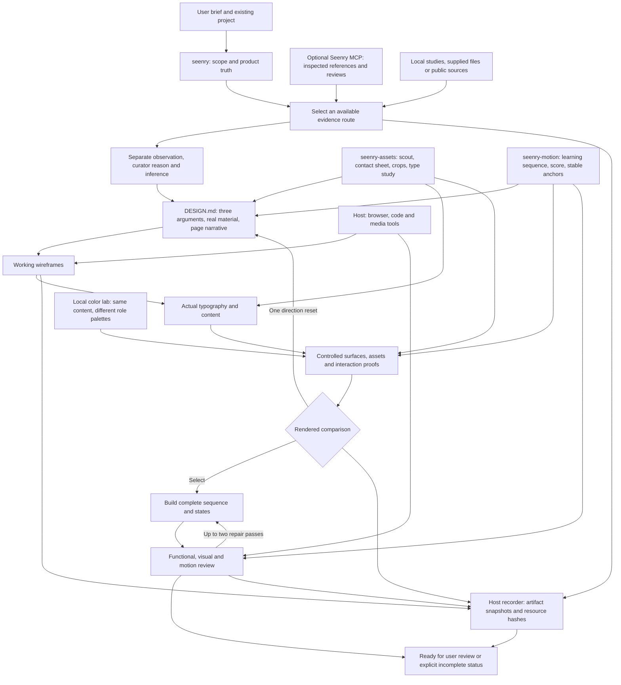

# Seenry architecture

Seenry owns the design process. The optional read-only MCP supplies additional evidence. Bundled guides and local studies keep the process available without it. The host supplies browsing, implementation, rendering and available model capabilities. Project records preserve decisions and measured results. None of these layers automatically certifies visual quality.

For a narrow fix, enter at the affected decision and verification; research-only requests stop at the requested comparison. Planning does not add an approval pause. For a missing visual capability, visual review stays pending. Actual authoring artifacts, not a final grid overlay, establish wireframe history.

| Package entrypoint | Owns | Does not own |
| --- | --- | --- |
| `seenry` | Brief, reference research, alternatives, layout/type/color, sequence, HCI and review | Invented editorial reasoning, blanket beauty scores |
| `seenry-motion` | Recorded evidence, microinteractions, morphs, scroll scores and lifecycle | Business state, payment/copy success, media rights |
| `seenry-assets` | Source/rights records, fonts, icons, marks, media and crops | Copying reference imagery as a default |
| `seenry-branding` | Identity and guideline research | Unrequested rebranding |
| `seenry-decks` | Ordered slide research and narrative | Invented claims or hidden slides |

No proprietary TALENT.md discovery is required. `SKILL.md` explicitly routes to focused references. Optional stage packets resolve selected files and sibling support with content hashes; native tool reads remain available. Installing files does not force an agent to execute stages. Records and external evidence are how adherence is assessed.

## Migration boundary

Design Judgment's four entrypoints and the old Web Atlas entrypoints (including the interim seenry-usage/seenry-web-design names) retire from local discovery. Their full local contents are archived, not copied wholesale into this public package. Selected original guidance and four small motion adapters are maintained here. The old coordinator, asset tools, study archives and benchmark histories remain available in the local migration archive or original source checkout. See [migration](MIGRATION.md).

The MCP endpoint and tool names remain compatible. MCP-bundled skill resources are deployed separately by the server repository; installing this package does not update those server-side documents. Local Seenry 2 instructions are the active package for a migrated client. Updating the server bundle should retain legacy resource IDs as compatibility resources and test new entrypoint retrieval before deployment.

A renamed package, successful installation and a passing schema test are not evidence of improved model taste. Use the frozen, matched [evaluation protocol](skills/seenry/references/evaluation.md) before announcing an improvement or competitor win.

## Execution and diagnosis

The [execution contract](skills/seenry/references/execution.md) connects project needs to stage packets and host tools. Media and motion can be unresolved at discovery; that uncertainty loads their planning guidance instead of silently excluding them. Research, actual image crops and choreography now feed concept selection. `workflow.py` preserves snapshots and checks order, media evidence types, missing capabilities and bounded revisions. It does not lock an arbitrary agent into the workflow or authenticate screenshots.

`asset_studio.py` accepts native-search manifests and supplies a bounded free Met Collection search plus real image crop/flat print studies. It deliberately separates temporary material from production approval. `type_lab.py` and `color_lab.py` compare actual content without inventing premium font or palette rankings. `score.mjs` provides deterministic choreography independent of an engine. The browser adapter creates measurable evidence; motion recordings still need normal-speed review.

The [quality diagnosis](skills/seenry/references/quality-diagnosis.md) targets contextual weaknesses and proposes controlled comparisons. Descriptor overlap flags cross-project convergence for inspection. Human-label coverage and held-out project splits make calibration auditable; they do not constitute a trained slop detector. The [casebook](skills/seenry/references/studies/casebook.md) labels inspected reference observations separately from original teaching exercises.

AGY can run with native host tools using `scripts/flash_trial.py`. If the model-side terminal is denied, preserve that run as blocked. `scripts/flash_stage.py` supports a separate host-rendered diagnostic without retrying the denied command: the model authors returned artifacts and the host runs rendering/tests. Record the different execution mode; it is not an autonomous-workflow pass.

## Visitor-facing quality gate

Planning records are backstage tools. The visitor sees the actual offering, visible work and useful actions. The content-and-finish guide resolves the opening, copy density, enclosure and control emphasis before expanding the grid. Comparison and review packets load a dedicated visual review. Five criteria remain separate; a functional pass cannot offset a failed opening or weak material. The local review_gate.py checks recorded disposition and evidence paths, not visual quality itself. User acceptance remains the final visual gate.
