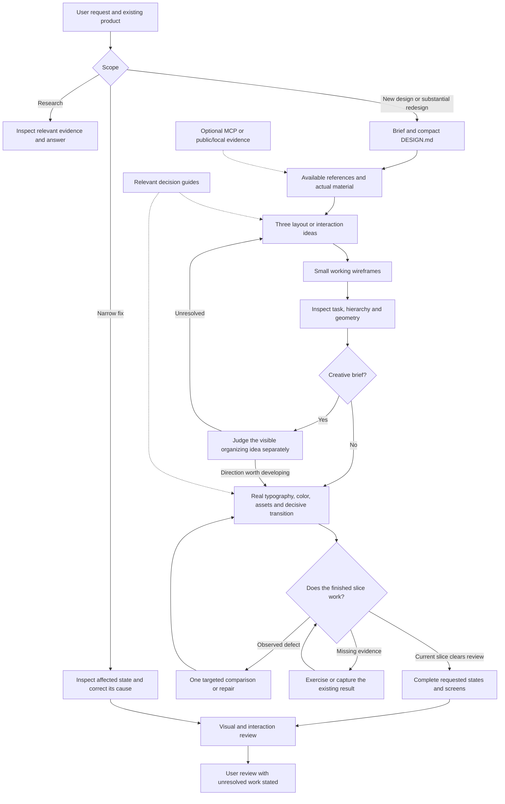

# Seenry architecture

Seenry turns a brief into design decisions and working evidence. The host supplies code, rendering and available research tools. MCP is an optional source of reference evidence. No layer certifies aesthetic quality automatically.

Optional Jev experiments use [bounded text decisions](skills/seenry/references/jev-decisions.md): the host prepares alternatives, Jev selects typed choices, code validates them, and browser review remains mandatory for visual claims. The [first live pilot](evals/jev-pilot/RESULTS.md) exercised three cases for an estimated $0.000111174 and matched the recorded host baseline. It demonstrates integration, not better design. The json-render composer is not a dependency of this path.

## Ordinary design work

Planning precedes product code. Three small working alternatives establish actual layout differences; only the retained direction receives deeper finish. Type, palette, boundaries and motion are decided on real content before expanding the design. Palette comparisons keep composition fixed. Narrow fixes do not restart the sequence.

The ordinary record is DESIGN.md plus source and relevant captures. Do not require model metadata, benchmark manifests or a sequence of separate agent runs for every design task. A complete project still needs usable states and rendered review. Use one direction reset and up to two repair passes before reporting unresolved work.

## Responsibilities and progressive reading

| Layer | Owns |
| --- | --- |
| `seenry` | Scope, product truth, layout exploration, shared decisions and review |
| `seenry-assets` | Actual fonts, marks, icons and material, crops and usage rights |
| `seenry-motion` | Behavior, anchors, feedback, interruption, choreography and lifecycle |
| `seenry-branding` / `seenry-decks` | Identity research and project brand/component usage rules / ordered presentation research |
| Host | Available tools, permissions, running code and inspecting output |
| Optional recorder | Evidence chronology and hashes, never an aesthetic verdict |

Read the entrypoint, then only the guide that answers the current unresolved decision. Keep advanced API references and examples available without inserting them into every task. Required runtime source, relative dependencies and licenses remain complete whenever a helper is selected. A compact packet must not omit an actual implementation dependency.

Keep historical output screenshots, source-specific research narratives and provider accounting outside the installed skill payload. Legacy decision topic names route to local technical examples without old images or preference labels. Current MCP research can retrieve exact CDN media URLs through the [asset evidence workflow](skills/seenry-assets/references/seenry-media.md); it is optional and does not turn reference media into licensed deliverable assets. The [context-efficiency study](docs/context-efficiency.md) documents actual skill loading, cache limits, full-handoff measurements and the accepted-output cost criterion. Runtime guides stay focused on making the interface.

## Optional model handoff and experiment path

Load [execution](skills/seenry/references/execution.md) when a restricted host, explicit recorder or requested benchmark needs it. New packet/handoff CLI calls default to the focused profile. Python and CLI packets default to focused guidance; explicit `--profile complete` remains available for broad audits. Neither profile automatically attaches historical screenshot lessons. Frozen past run records and the v2.0.0 release preserve previous evidence.

Research routing is resolved once: explicit argument → project research_source → auto. Explicit local-only requests stay local. Missing MCP does not silently disable ordinary browsing. Review receives a short motion/material contract when those needs are present. Anonymous review uses `review_request.py` so creator positioning does not enter the critique.

Creative construction can opt into `concept_review: true` in both project and review manifest. The recorder then requires a separate concept judgment alongside content, hierarchy and geometry before advancing; surface/final retain five criteria. The flag is explicit and defaults false for historical/ordinary runs. In native work, apply the same distinction without requiring recorder files. Neither route turns a model's judgment into human acceptance.

Focused packets preserve project decisions and source hashes, and load teaching examples only for an explicit unresolved topic. They expose their resource count, word count and UTF-8 byte count; those measurements exclude project/source/image payloads and are not token or speed claims. Selected runtime files are hashed and staged separately. No content is truncated to meet a size target.

## Diagnose before spending another generation

First identify the failure layer: wrong scope or facts; weak layout/idea; unresolved type/color/material; broken behavior; or missing observation. Record what is visible, why it affects the task, the proposed cause and the smallest useful correction. Collect missing evidence with source unchanged. Do not fix a weak idea by repeatedly changing borders or adding an effect.

Validate structure cheaply before generating more designs: scope routing, source precedence, bounded generic guidance, helper/dependency completeness, relocation and full review criteria. Then use one fresh representative task for the changed behavior. A broad blinded benchmark is for an actual performance claim or a new generalization question, not every documentation edit. Skill engineering does not retrain model weights. Faster delivery and passing structural checks do not establish better taste; human outcome evidence remains mixed.

### Local structural check, 2.0.1-dev.1

For the same `scope: component`, `media: none`, `motion: feedback`, `research_source: local` surface packet, v2.0.0 supplied 10,426 resource-body words with its old complete CLI default, or 7,186 with its optional focused profile. The revised focused default supplies 1,948. This counts resource text only; it does not measure token cost, generation time or visual quality. Explicit topic studies and selected implementation dependencies can legitimately increase the packet.

137 Python tests and the package validator pass locally on macOS, including real review-request routing, missing-dependency failures, source hashes and relocated resources. An independent planning-only desk-booking task preserved the host identity, proposed three structural alternatives and marked all implementation/visual checks pending. It also revealed an unnecessary full color-guide read; offline guidance now makes that read conditional. No new broad model benchmark or cross-platform runtime verification was performed for this revision.

## Candidate: decision craft

Create, refine and review route separately. New designs retain three structural slices; narrow fixes load only their current decision. `packet.py refine --decision controls --research-source local` supplies the working contract, one craft guide and one standalone example. Choices are layout, typography, color, controls, motion and art-direction. Decision packets require focused; complete packets preserve the broader historical workflow. Python and CLI defaults agree on focused.

The selector does not infer every project topic or include a full stage packet. Project decisions remain intact; request another decision or stage packet for a genuine dependency. Supplied bodies are hashed; missing selected files fail before returning a packet. Guidance sizes include example source: these are bytes/words, not provider tokens. The host loads the entrypoint once. Supplied, read, applied, checked and human accepted remain distinct.

The learning loop is maintenance guidance, not model training. Rejection creates a scoped hypothesis. Shared defaults require transfer and counterexample checks. Candidate changes are withheld from release until staged human/functional gates pass.
